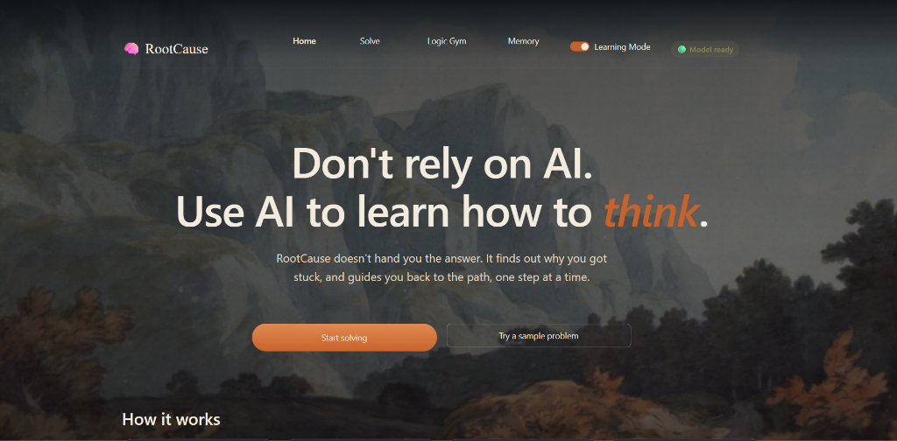
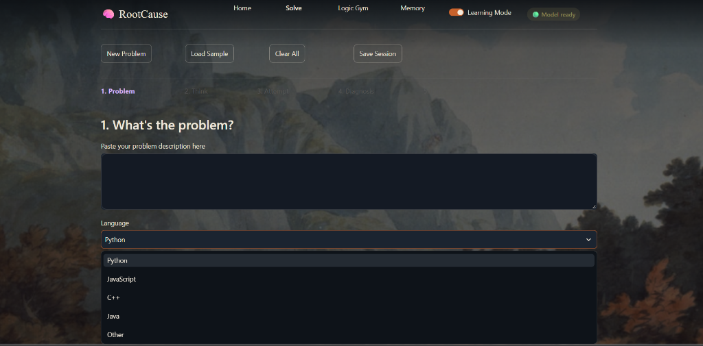

# RootCause

RootCause is a coding companion that diagnoses why you are stuck instead of giving you the answer.

I built this for a friend, Ojju, who was learning to code but kept getting stuck on logic errors. When he used standard tools, they handed him the corrected code immediately, which solved the problem but didn't help him learn how to fix it himself next time. RootCause forces you to explain your approach first, reads your broken code, and points out the specific conceptual or logic gap you are missing.

[TODO: one real thing Ojju said after trying it]


## Live Demo
You can access the live version of this application here:
?? **[Live Demo on Hugging Face Spaces](https://huggingface.co/spaces)** *(Note: Initial startup may take 2-3 minutes as the local LLM loads into memory).*

## Screenshots





## What it does

- **Solve flow:** You explain your approach, paste your broken code, and provide the error. The system diagnoses the exact gap. It gives you progressive hints and a small micro-exercise to practice the missing concept.
- **Logic Gym:** A set of short logic workouts. You can do pattern finding, code tracing, bug spotting, and edge-case hunting. It tracks your topic mastery, day streak, and XP. 
- **My Memory:** The system remembers which concepts you struggle with and suggests targeted weak-spot workouts.

## Why local and open models

RootCause runs locally using the Gemma 3 (4B) model through Ollama. I chose this because it costs nothing to run, works completely offline, and ensures your code and learning data never leave your laptop. It does not require an account or a server. The model name is a single setting in config (currently tested with gemma3:4b).

## How to run

Prerequisites:
- Python 3.10 or higher
- Ollama installed

Open your terminal and run:
1. Pull the model:
   ```bash
   ollama pull gemma3:4b
   ```
2. Install the requirements:
   ```bash
   pip install -r requirements.txt
   ```
3. Start the application:
   ```bash
   streamlit run app.py
   ```

On the first run, the app will create a local SQLite database to store your progress.

## How the diagnosis was tested

The diagnostic logic is tested using a frozen suite of test cases in tests.json. Running `python run_tests.py` verifies that the LLM correctly categorizes the knowledge gap for specific broken code examples without leaking the answer. The current suite passes 6 out of 6 tests with gemma3:4b. Note that six tests is a small suite.

## Known limits and what is not done

- Responses can be slow on laptops that run the model partially or fully on the CPU.
- The 4B parameter model sometimes misjudges free-text answers in the Logic Gym.
- Weak-spot tracking currently relies on simple rolling averages.

## Project structure

- app.py: Main entry point for the Streamlit application.
- core/: Logic for the LLM client, diagnosis engine, and Gym answer checking.
- pages/: Streamlit UI views for Home, Solve, Logic Gym, and Memory.
- ui/: Shared UI components and the CSS theme.
- static/: Local fonts and the background image.
- docs/: Screenshots and documentation.

## Credits

- Background painting: [TODO: painting credit]
- Fonts: Fraunces, Inter, and JetBrains Mono.
- Powered by Ollama, Gemma, and Streamlit.

## License

MIT License. Copyright (c) 2026 [YOUR NAME].
